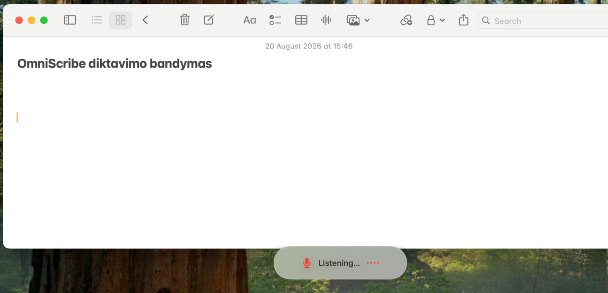
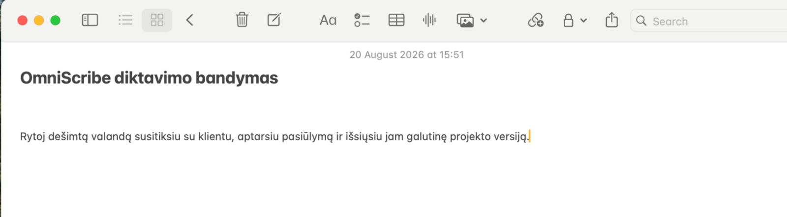
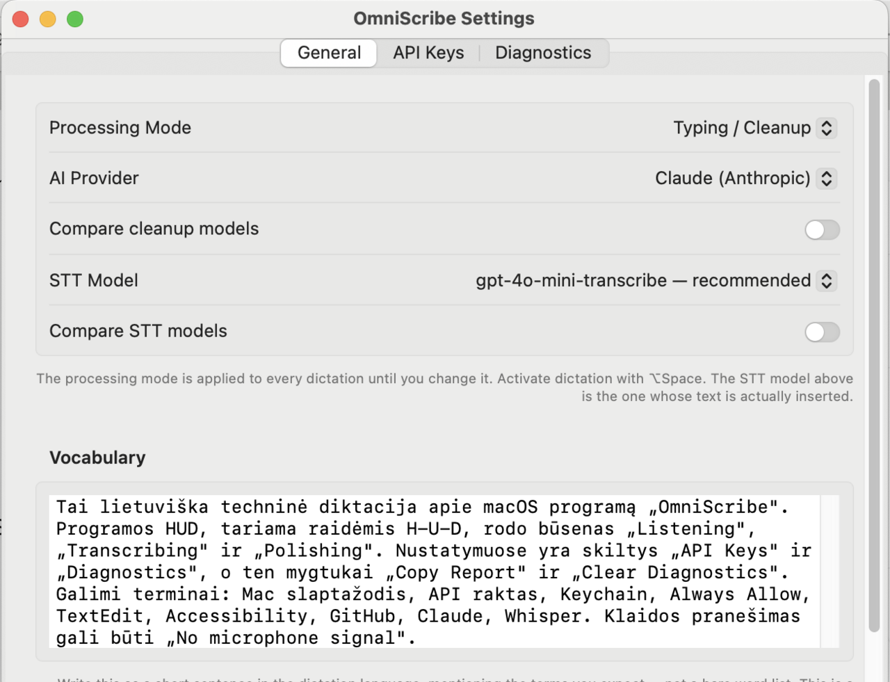
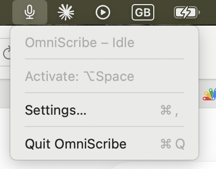

  

<h1 align="center">OmniScribe</h1>

  <strong>Balso diktavimas lietuviškai — bet kurioje macOS programoje.</strong>

  
  
  

---

Paspaudi **⌥Space**, kalbi lietuviškai — ir **sutvarkytas tekstas atsiranda ten,
kur tavo žymeklis**. Mail, Pages, Safari, Slack, bet kur.

Apple lietuvių kalbos diktavimo nepalaiko iki šiol. Tai — sprendimas tam.

Programa gyvena meniu juostoje: jokio lango, jokios Dock ikonos. Balsą į tekstą
verčia **GPT-4o mini Transcribe** (OpenAI), tekstą sutvarko **Claude**
(Anthropic).

## Kaip tai veikia

**1. Paspausk ⌥Space ir kalbėk.** Ekrano apačioje pasirodo diktavimo indikatorius.

  

**2. Baigus kalbėti, sutvarkytas tekstas įterpiamas ten, kur buvo žymeklis.**

  

### Meniu ir nustatymai

  
   
  

## Ką reikia žinoti prieš diegiant

| | |
|---|---|
| **Kaina** | Programa nemokama. Naudoji **savo** OpenAI ir Anthropic raktus, tad apmoki savo naudojimą — apytiksliai keli eurai per mėnesį |
| **Reikia** | macOS 12 (Monterey) ar naujesnės. Veikia ir su **Intel**, ir su Apple Silicon |
| **Senesnis Mac tinka** | MacBook Air ir Pro nuo 2015 m., Mac mini nuo 2014 m., iMac nuo 2015 m. |
| **Parašas** | ⚠️ **Nenotarizuota Apple.** Diegiant reikės rankomis pašalinti karantiną |
| **Stadija** | Beta. Kai kas neveiks |
| **Paruošimas** | ~15–20 min., daugiausia — API raktų susikūrimas |

## Parsisiuntimas

**[⬇️ Atsisiųsti naujausią versiją](https://github.com/Rimantas-AI/omniScribe/releases/latest)** — be prisijungimo prie GitHub.

Toliau — **[diegimo instrukcija](docs/DIEGIMAS.md)**.

## Kur dingsta tavo duomenys ir raktai

Programa prašo dviejų API raktų, todėl klausimas „ar ji jų kur nors nenusiųs?”
yra teisingas klausimas.

- **Raktai laikomi macOS Keychain** — ne faile, ne programos viduje
- **Iš tavo turinio siunčiami tik du dalykai:** garsas į `api.openai.com`,
  tekstas į `api.anthropic.com`. Tai vieninteliai du adresai visame kode
- **Savo serverio neturiu** — nei statistikai, nei atnaujinimams
- **Jokios telemetrijos.** Diagnostikos statistika (pagal nutylėjimą išjungta)
  lieka tavo kompiuteryje

Nesitikiu, kad patikėsi vien žodžiu — **[`SECURITY.md`](SECURITY.md)** rodo, kaip
pasitikrinti pačiam: kontrolinė suma, kompiliavimas iš kodo, tinklo stebėjimas.

## Dokumentacija

- 📥 **[Diegimas](docs/DIEGIMAS.md)** — parsisiuntimas, Gatekeeper, leidimai, API raktai
- 📖 **[Naudojimas](docs/NAUDOJIMAS.md)** — režimai, klavišų derinys, ribos
- 🔧 **[Problemų sprendimas](docs/PROBLEMOS.md)** — kai kas nors neveikia
- 🔒 **[Saugumas](SECURITY.md)** — ką programa daro su duomenimis ir kaip patikrinti

## Licencija

Kodą galima **skaityti, tikrinti ir savarankiškai sukompiliuoti** — kaip tik tam,
kad galėtum įsitikinti, jog paskelbtas vykdomasis failas atitinka paskelbtą kodą.

Bet tai **ne** atviro kodo licencija: platinti, parduoti ar leisti savo versijos
negalima be sutikimo. → [`LICENSE`](LICENSE)

## ☕ Patiko? Pavaišink kava

Jei sutaupė tau laiko ir nori padėkoti — gali įmesti kelias EUR kavai.
Kiekvienas puodelis motyvuoja tobulinti toliau 🙏

- ☕ **Ko-fi:** https://ko-fi.com/rimantasd
- 💳 **Revolut:** https://revolut.me/rimant6ap
