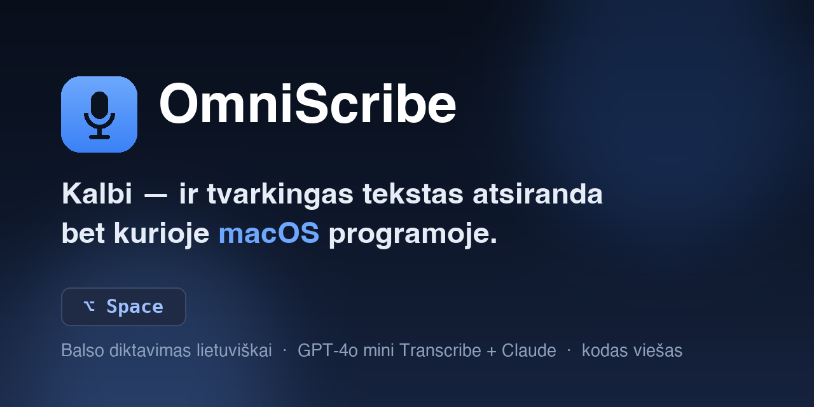

<p align="center">
  
</p>

# OmniScribe — naudojimo instrukcija

[](https://github.com/g4me2011-lang/omniScribe/actions/workflows/build.yml)
[](LICENSE)

Balso diktavimo įrankis macOS'ui. Paspaudi **⌥Space**, kalbi lietuviškai — ir
sutvarkytas tekstas atsiranda ten, kur tavo žymeklis (bet kurioje programoje).

> 💡 **Paprasčiausias parsisiuntimas:** eik į repo
> [**Releases**](https://github.com/g4me2011-lang/omniScribe/releases) skiltį ir
> parsisiųsk `OmniScribe.zip` — vienu paspaudimu, be prisijungimo. (Jei Releases dar
> tuščias, naudok Actions Artifacts, kaip aprašyta žemiau.)

Po nugara: balsą į tekstą verčia **OpenAI Whisper**, tekstą sutvarko **Claude**, o
rezultatas įterpiamas per iškarpinę. Programa gyvena **meniu juostoje** — jokio lango,
jokios Dock ikonos.

> **Reikia:** macOS 12 ar naujesnės, interneto, ir dviejų API raktų —
> **OpenAI** (balso atpažinimui) ir **Claude/Anthropic** (teksto redagavimui).

---

## 0. Kur dingsta tavo duomenys ir raktai

Programa prašo dviejų API raktų, todėl klausimas „ar ji jų kur nors nenusiųs?"
yra teisingas klausimas. Trumpas atsakymas ir kur jį pačiam pasitikrinti:

**Raktai laikomi macOS Keychain**, ne faile ir ne programos viduje.
→ [`OmniScribe/KeychainManager.swift`](OmniScribe/KeychainManager.swift)

**Iš tavo kompiuterio išeina lygiai du dalykai, ir daugiau nieko:**

| Kas | Kur | Kodėl |
|---|---|---|
| Įrašytas garsas | `api.openai.com` | Balsą paversti tekstu |
| Gautas tekstas | `api.anthropic.com` | Sutvarkyti gramatiką |

→ [`CloudWhisperService.swift`](OmniScribe/CloudWhisperService.swift) · [`ClaudeService.swift`](OmniScribe/ClaudeService.swift)

Tai vieninteliai du adresai visame kode. **Savo serverio neturiu** — nei
statistikai, nei atnaujinimams, nei niekam. Tavo raktai keliauja tik į tų
dviejų paslaugų API, tiesiogiai iš tavo kompiuterio.

**Jokios telemetrijos ir jokio sekimo.** Diagnostikos statistika (jei ją
apskritai įjungsi — pagal nutylėjimą išjungta) rašoma į CSV failą tavo
kompiuteryje ir niekur nesiunčiama; joje nėra nei teksto, nei garso, vien
skaičiai. → [`UsageLog.swift`](OmniScribe/UsageLog.swift)

**Ką programa dar daro:** klausosi vieno klavišų derinio (todėl reikia
Accessibility leidimo) ir įklijuoja tekstą per iškarpinę.
→ [`HotkeyManager.swift`](OmniScribe/HotkeyManager.swift) · [`TextInjector.swift`](OmniScribe/TextInjector.swift)

> ⚠️ **Programa dar nenotarizuota Apple.** Tai reiškia, kad macOS nepatikrino
> nei manęs kaip kūrėjo, nei paties failo, ir diegiant reikės apeiti karantiną
> ranka. Notarizacija planuose, bet kol jos nėra — nesitikiu, kad pasitikėsi
> vien mano žodžiu. Būtent todėl šaltinio kodas yra viešai matomas: pasitikrink pats arba
> paprašyk ką nors, kas moka skaityti Swift.

**Licencija:** kodas viešas, kad jį būtų galima peržiūrėti, bet **ne** atviro
kodo licencija — platinti, parduoti ar leisti savo versijos negalima be
sutikimo. → [`LICENSE`](LICENSE)

---

## 1. Parsisiuntimas

1. Prisijunk prie GitHub → atidaryk repo **Actions** skiltį.
2. Spausk paskutinį žalią (✅) **„Build OmniScribe"** paleidimą.
3. Puslapio apačioje, **Artifacts**, spausk **OmniScribe-app** → parsisiųs `.zip`.
4. Išarchyvuok (dukart, kol gausi failą **`OmniScribe.app`** su programos ikona).
5. Nutempk `OmniScribe.app` į **Applications** (Programos).

---

## 2. Pirmas paleidimas

### 2a. Leisk atidaryti (Gatekeeper)

Programa pasirašyta laikinai, todėl macOS pirmą kartą blokuoja. **Terminale** paleisk:

```bash
xattr -dr com.apple.quarantine /Applications/OmniScribe.app
```

Tada paleisk `OmniScribe.app` (dukart). Jei vis tiek klausia — **dešinys pelės
klavišas → Open → Open**, arba: **System Settings → Privacy & Security** → apačioje
**„Open Anyway"**.

> Meniu juostos viršuje (dešinėje, prie laikrodžio) atsiras **mikrofono ikona**.
> **Lango nebus — tai normalu.** Spausk ikoną → matysi meniu (Settings, Quit).

### 2b. Suteik leidimus

Nustatymuose (macOS 15: **System Settings**, macOS 12: **System Preferences**) →
**Privacy & Security**:

| Leidimas | Kam reikia |
|---|---|
| **Microphone** | įrašyti balsą |
| **Accessibility** | ⌥Space klavišui **ir** teksto įterpimui |
| **Input Monitoring** *(dažnai reikia macOS 12'e)* | klaviatūros klavišui perimti |

Įjunk **OmniScribe** kiekviename sąraše, tada **uždaryk ir paleisk programą iš naujo**
(Accessibility įsigalioja tik po perkrovimo).

### 2c. Įvesk API raktus

Meniu ikona → **Settings… → API Keys**:

- **GPT (OpenAI)** laukelyje → įklijuok OpenAI raktą (`sk-...` arba `sk-proj-...`)
- **Claude** laukelyje → įklijuok Anthropic raktą (`sk-ant-...`)

Spausk **Save**. Iššoks **Keychain** langas → įrašyk savo **Mac slaptažodį** →
**Always Allow**. Prie abiejų turi atsirasti žalias **„Stored"** ✓.

> ⚠️ **Nesupainiok laukelių:** `sk-...` = OpenAI, `sk-ant-...` = Claude. Sukeitus —
> abu bus atmesti (klaida 401).
> ⚠️ **Raktai saugomi tik šiame kompiuteryje.** Kitame Mac'e juos reikia įvesti iš naujo.
> ⚠️ **OpenAI paskyroje turi būti kredito** (Billing), kitaip mes klaidą `429`.

Raktus gauni:
- OpenAI: <https://platform.openai.com/api-keys>
- Claude: <https://console.anthropic.com> → API Keys

---

## 3. Kaip naudoti

1. Pastatyk žymeklį ten, kur nori teksto (TextEdit, Mail, naršyklė, žinutės…).
2. Paspausk **⌥ (Option) + Space** — apačioje atsiras įrašymo indikatorius.
3. Kalbėk **lietuviškai, aiškiai**.
4. Nutilk ~2 sek. (arba paspausk **⌥Space dar kartą**) — įrašymas sustos.
5. Po kelių sekundžių sutvarkytas tekstas atsiras ties žymekliu.

**Režimą** keiti: meniu → **Settings → General → Processing Mode**:
- **Typing / Cleanup** — sutvarko gramatiką
- **Email** — perrašo į dalykišką laišką
- **Code** — paverčia į kodą
- **Messenger** — trumpa žinutė
- **Translation** — vertimas

---

## 3a. Diktavimo trukmė (limitai)

- **Kol kalbi be ~2 sek. pauzės** — įrašoma toliau, fiksuoto laiko limito nėra.
- Nutildžius ~2 sek. — įrašymas **sustoja automatiškai** (arba paspausk ⌥Space).
- Vienas diktavimas patikimai veikia **iki kelių minučių** (transkripcijos užklausos
  riba — 120 s; OpenAI failo riba — 25 MB ≈ ~13 min garso).
- Labai ilgo teksto **redaguotas** rezultatas gali būti apkarpytas (Claude ~8000
  token'ų riba, ~5000 žodžių).

💡 **Patarimas:** diktuok sakiniais ar pastraipomis, nutildamas tarp jų — natūraliausia
ir patikimiausia. Ilgesniems tekstams — kelios trumpos „porcijos".

## 4. Problemų sprendimas

| Problema | Sprendimas |
|---|---|
| **„OmniScribe is damaged" / neatidaro** | Terminale: `xattr -dr com.apple.quarantine /Applications/OmniScribe.app`, tada paleisk |
| **„Safari can't open the file"** | Neatidarinėk iš Safari — eik per **Finder → Applications** |
| **Paleidus nieko nerodo** | Tai normalu — ieškok **mikrofono ikonos ekrano viršuje dešinėje**, ne lango |
| **⌥Space neveikia** | Įjunk **Accessibility** (macOS 12: dar ir **Input Monitoring**) → **paleisk iš naujo**. Patikrink, ar ⌥Space neužimtas įvesties šaltinio perjungimui (Keyboard nustatymai) |
| **Tekstas neatsiranda** | Patikrink logus (žr. žemiau). Dažniausiai — neįvesti/blogi API raktai arba mikrofonas negauna balso |
| **Transkripcija „🎵🎵🎵"** | Mikrofonas negauna balso: **Sound → Input** pasirink teisingą mikrofoną ir žiūrėk, kad „Input level" juostelė judėtų kalbant; išjunk foninę muziką |
| **Neišsijungia pats po tylos** | Ta pati priežastis — mikrofonas negauna kalbos. Kol kas stabdyk **⌥Space dar kartą** |
| **Klaida „API key was rejected" (401)** | Blogas arba sukeistas raktas. Settings → API Keys → **Remove** → įvesk teisingą (`sk-...` OpenAI, `sk-ant-...` Claude) |
| **Klaida „429" / „insufficient_quota"** | OpenAI paskyroje nėra kredito — pridėk Billing'e |
| **„Network Error"** | Nėra interneto |
| **Kelios mikrofono ikonos meniu juostoje** | Terminale: `killall OmniScribe`, tada paleisk vieną kartą iš Applications |
| **Keychain klausia slaptažodžio** | Įrašyk **Mac** slaptažodį (ne API raktą) → **Always Allow** |
| **Po naujos versijos ⌥Space nustojo veikti** | Naujas parašas → Accessibility teks suteikti iš naujo: pašalink seną „–", pridėk naują „+", perkrauk |

### Kaip pamatyti tikslią klaidą (logus)

Uždaryk programą, tada **Terminale**:

```bash
/Applications/OmniScribe.app/Contents/MacOS/OmniScribe
```

Padiktuok (⌥Space → kalbėk → nutilk) ir žiūrėk į eilutes:
- `📝 Transcription (...): "..."` — ką atpažino
- `✨ Processed (...)` — ką sutvarkė Claude
- `⌨️ Inserted into the focused app.` — įterpta
- `❌ Pipeline failed: ...` — **tiksli klaida** (parodys, kur problema)

> ⚠️ **Svarbu:** paleidžiant per Terminalą, leidimus (Microphone, Accessibility)
> reikia suteikti **Terminalui**, ne OmniScribe. Kitaip mikrofonas paduos tylą
> (`"🎵🎵🎵"`). Kasdieniam naudojimui — paleisk `OmniScribe.app` **įprastai iš
> Applications**, ne per Terminalą.

---

## 5. Kasdienis naudojimas — trumpai

Kai viską sutvarkei vieną kartą:
1. Paleisk `OmniScribe.app` iš Applications (dukart).
2. Meniu juostoje — viena mikrofono ikona.
3. Bet kur → **⌥Space** → kalbėk → tekstas atsiranda.

Terminalo, logų, `xattr` kasdien **nereikia** — jie tik pirmam diegimui ar
problemų sprendimui.

---

## ☕ Patiko? Pavaišink kava

OmniScribe yra **nemokamas, o jo šaltinio kodą galima viešai peržiūrėti**. Projektas platinamas pagal nuosavybinę licenciją — kodo negalima platinti, parduoti ar leisti savo versijos be autoriaus sutikimo. Jei sutaupė tau laiko ir nori padėkoti —
gali įmesti kelias EUR kavai. Kiekvienas puodelis motyvuoja tobulinti toliau 🙏

- ☕ **Ko-fi:** https://ko-fi.com/rimantasd
- 💳 **Revolut:** https://revolut.me/rimant6ap

*(Ačiū, kad naudoji!)*

## 6. Naujos versijos diegimas

Kai atsiranda naujas build'as (po kodo pakeitimo):
1. Parsisiųsk naują artefaktą iš Actions (kaip 1 skyriuje).
2. Pakeisk seną `.app` Applications aplanke.
3. `xattr -dr com.apple.quarantine /Applications/OmniScribe.app`
4. **Accessibility suteik iš naujo** (parašas pasikeitė) → perkrauk.
5. API raktai Keychain'e išlieka — jų iš naujo vesti nereikia.
